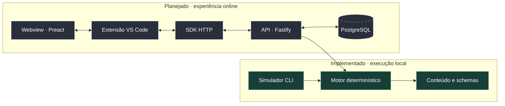

<div align="center">

# Lords of the Guild

**Um feudo para governar nas pausas do café. Uma semana para viver um ano.**

[](https://github.com/gustavopals/pals-vscode-game/actions/workflows/ci.yml)


[O jogo](#o-jogo) · [Experimente](#experimente) · [Engenharia](#engenharia) · [Roadmap](#roadmap) · [Documentação](#documentacao)

</div>


<a id="o-jogo"></a>

## Seu próximo reino cabe no VS Code

**Lords of the Guild** é um jogo medieval de estratégia e gerenciamento assíncrono, projetado para ser jogado dentro do editor. Você assume Pedra Alta, distribui o trabalho dos aldeões, melhora edifícios e decide como transformar uma pequena vila em um feudo capaz de atravessar o inverno.

A proposta é simples: sessões de **2 a 10 minutos**, decisões que continuam produzindo efeitos durante sua ausência e uma Crônica que conta a história do seu reino quando você volta.

> **Já dá para experimentar:** o motor de economia e o simulador local estão implementados, com testes automatizados. A API online, a extensão e a interface são as próximas etapas. As imagens deste README são **artes conceituais**, criadas com IA para apresentar o universo do jogo.

### Quatro estações. Uma história para contar.


| 🌱 Primavera | ☀️ Verão | 🍂 Outono | ❄️ Inverno |
| :---: | :---: | :---: | :---: |
| Construir e crescer | Explorar com a Guilda | Abastecer e preparar | Resistir ao cerco |

Esse é o ciclo previsto para a evolução do jogo. A fundação atual implementa economia, obras, recrutamento, fome, objetivos e Crônica; efeitos sazonais, exploração e combate chegam nas próximas versões.

<a id="experimente"></a>

## Veja uma semana acontecer em segundos

O simulador permite conhecer as regras do jogo **sem Docker, servidor ou extensão**. Um bot econômico administra o feudo, e o motor calcula os acontecimentos entre as sessões.

Você precisa de **Node.js 22.12+** e **pnpm 9.15.9**, fixado no projeto. Com `nvm` e Corepack disponíveis:

```bash
git clone https://github.com/gustavopals/pals-vscode-game.git
cd pals-vscode-game
nvm use
corepack enable
pnpm install --frozen-lockfile
pnpm verify
```

Simule sete dias, com duas visitas ao feudo por dia:

```bash
pnpm -s sim -- --seed pedra-alta-golden --days 7 --strategy economico --sessions-per-day 2 > semana.csv
```

O terminal mostra o resumo da partida; `semana.csv` recebe **168 retratos horários** da economia, população e construções. A mesma semente e as mesmas opções reproduzem o mesmo resultado na mesma versão do motor e do conteúdo.

Exemplo de resultado dessa simulação:

```text
População: 26 de 35 vagas
Níveis: townHall 3, farm 4, lumberMill 3, quarry 3, goldMine 3, housing 4
Estoque: food 162, wood 10017, stone 4190, gold 1637
Fome: nenhuma
Comandos: 55 aceitos, 0 recusados
```

Quer investigar o equilíbrio? Mude `--sessions-per-day` para `1` e compare os arquivos. O [guia do simulador](packages/sim-cli/README.md) explica o bot, cada coluna do CSV e as faixas verificadas nos testes.

<a id="engenharia"></a>

## Por trás do reino

O desafio técnico é fazer o tempo passar de forma consistente: uma hora calculada de uma vez precisa produzir o mesmo estado e os mesmos eventos que uma hora dividida em várias visitas.

| Decisão | Como aparece no código |
| --- | --- |
| **Motor puro e determinístico** | Estado, comandos e tempo explícitos; sem rede, relógio do sistema ou dependência do editor. [Contrato público](packages/engine/src/index.ts) e [testes de pureza](packages/engine/src/purity.test.ts). |
| **Economia sem deriva de arredondamento** | Recursos em unidades inteiras de milésimos, com acumuladores. [Implementação](packages/engine/src/economy.ts) e [testes de propriedades com fast-check](packages/engine/src/economy.property.test.ts). |
| **Balanceamento separado das regras** | Números e textos em `content`, validados por schemas; comportamento em `engine`. [Conteúdo](packages/content/src) e [testes de balanceamento](packages/sim-cli/src/balance.test.ts). |
| **Partidas reproduzíveis** | Cenário de sete dias e snapshots de referência ajudam a detectar mudanças de comportamento. [Teste de cenário](packages/engine/src/scenario.test.ts). |
| **Contratos documentados antes da integração** | Autenticação, comandos idempotentes, cache e exclusão de conta têm decisões registradas para orientar a futura API. [ADRs](docs/decisions/README.md). |

### Um núcleo, dois caminhos de execução

A arquitetura alvo conecta o mesmo motor ao simulador e ao servidor. O núcleo local está implementado; o caminho online e a interface são as próximas etapas.



**Base atual:** TypeScript, pnpm workspaces, Zod, Vitest, fast-check, ESLint, Prettier, Docker e workflow de GitHub Actions. **Stack prevista para a experiência online:** Fastify, PostgreSQL, API do VS Code e Preact.

<details>
<summary><strong>Explore a organização do monorepo</strong></summary>

```text
packages/
  engine/       Regras puras, economia e avanço do tempo
  content/      Números, textos e schemas do jogo
  sim-cli/      Bot econômico, simulações e relatórios CSV
  protocol/     Base para os contratos da API /v1
  server/       Base para o servidor autoritativo
  client-sdk/   Base para o cliente HTTP tipado
  extension/    Base para a extensão do VS Code
  webview/      Base para a interface em Preact
deploy/         Dockerfile, Compose e configuração de ambiente
tests/          Estrutura para integração entre pacotes
docs/decisions/ Decisões de arquitetura e seus motivos
```

O ESLint impede que `engine`, `content` e `protocol` importem `vscode`, `fastify`, `pg` ou módulos do Node, preservando a independência do núcleo.

</details>

<details>
<summary><strong>Comandos e ambiente de desenvolvimento</strong></summary>

| Comando | O que faz |
| --- | --- |
| `pnpm verify` | Executa lint, checagem de tipos e testes unitários |
| `pnpm test` | Executa a suíte unitária com Vitest |
| `pnpm --filter @lotg/engine test` | Executa apenas os testes do motor |
| `pnpm typecheck` | Confere os tipos em todos os pacotes |
| `pnpm lint` / `pnpm format` | Verifica / aplica a formatação do código |
| `pnpm build` | Compila os pacotes que têm build |
| `pnpm dev:up` / `pnpm dev:down` | Sobe / encerra os bancos locais, preservando volumes |
| `pnpm dev:logs` | Acompanha os logs dos contêineres |
| `pnpm db:psql` | Abre o PostgreSQL de desenvolvimento |
| `pnpm test:integration` | Executa testes de integração com `TEST_DATABASE_URL` definido |
| `pnpm secrets:gen` | Cria `deploy/.env` e gera segredos ausentes, preservando os existentes |
| `pnpm docker:build` | Constrói a imagem de produção da API |

Para trabalhar com os bancos, instale Docker com Compose v2 e execute `pnpm dev:up`. O [Compose de desenvolvimento](deploy/docker-compose.dev.yml) publica as portas somente em `127.0.0.1`:

| Serviço | Porta | Persistência |
| --- | --- | --- |
| `db` — banco `lotg`, usuário/senha `lotg` | 5432 | Volume `lotg_db_dev` |
| `db_test` — banco `lotg_test` | 5433 | `tmpfs`, descartado ao reiniciar |
| `pgweb` — ferramenta opcional | 8081 | Inspeção do banco |

```bash
docker compose -f deploy/docker-compose.dev.yml --profile tools up -d pgweb
```

A API está prevista para rodar no host durante o desenvolvimento ([ADR 0001](docs/decisions/0001-api-no-host-em-dev.md)). O perfil `full` reserva a porta 3000 para a imagem da API, mas o servidor HTTP ainda não está implementado.

`pnpm dev:api`, `pnpm db:migrate` e `pnpm dev:ext` ainda são comandos de preparação: informam a tarefa pendente no roadmap. A suíte de integração também aguarda a implementação do servidor.

Configurações estão em [deploy/.env.example](deploy/.env.example). `JWT_SECRET` e `RECOVERY_CODE_SECRET` são independentes; a rotação do segundo invalidará os Códigos do Reino emitidos. No WSL2, mantenha o repositório no sistema de arquivos Linux. `docker compose down -v` apaga os volumes do banco.

Para atualizar snapshots de referência intencionalmente, use `UPDATE_GOLDEN=1 pnpm test` e revise o diff antes de commitar.

</details>

<a id="roadmap"></a>

## A jornada de Pedra Alta

| Etapa | Situação |
| --- | --- |
| **Fundação técnica** — monorepo, ferramentas, Docker e workflow de CI | Implementada |
| **Motor e playtest local** — economia, construção, população, objetivos e simulador | Implementados |
| **MVP online · v0.1** — conta, API, persistência e extensão jogável | Próxima entrega |
| **Estações e Conselho · v0.2** — decisões sazonais | Planejado |
| **Guilda · v0.3** — heróis e exploração | Planejado |
| **Guerra e Cerco · v0.4** — defesa do feudo no inverno | Planejado |
| **Mundo, legado e polimento · v0.5–v0.6** | Planejados |

O [roadmap do MVP](MVP-ROADMAP.md) detalha tarefas e critérios de aceite. O [Game Design Document](GAME_DESIGN.md) apresenta a visão completa, incluindo a evolução futura para multiplayer.

<a id="documentacao"></a>

## Conheça as escolhas do projeto

- **[Game Design Document](GAME_DESIGN.md)** — experiência, sistemas, regras e escopo de cada versão.
- **[Plano de execução](MVP-ROADMAP.md)** — entregas, dependências e verificações do MVP.
- **[Decisões de arquitetura](docs/decisions/README.md)** — contexto e justificativas dos contratos técnicos.
- **[Guia do simulador](packages/sim-cli/README.md)** — rode partidas, leia os relatórios e investigue o balanceamento.

---

<div align="center">

**Um projeto de [@gustavopals](https://github.com/gustavopals)**

Game design, simulação determinística e uma experiência pensada para o cotidiano de quem programa.

<sub>Ilustrações conceituais geradas com IA · <a href="docs/assets/readme/ARTWORK.md">Prompts e arquivos das artes</a></sub>

</div>
