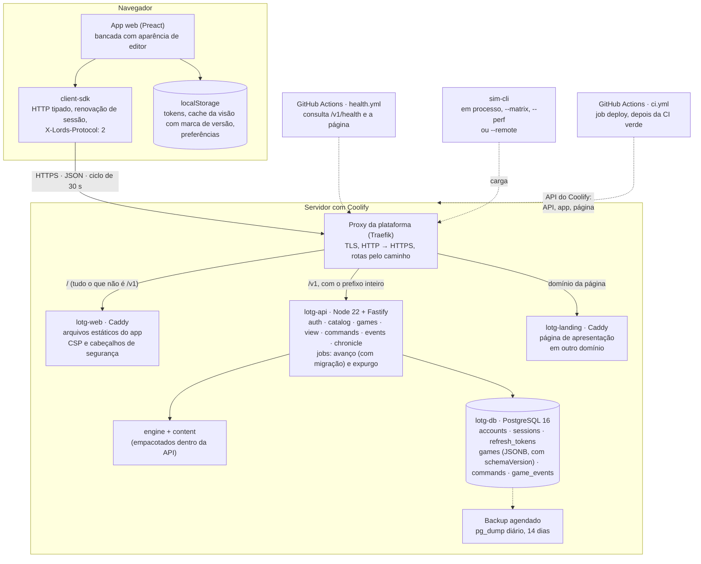
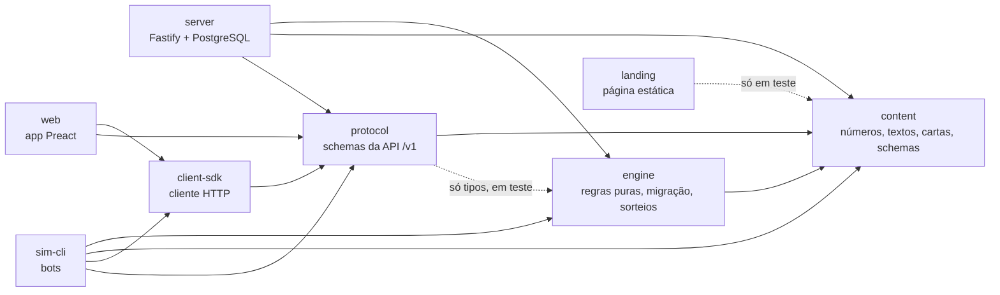

# Arquitetura da v0.2

O que está construído em Lords of the Guild depois da v0.2 "Estações e Conselho", como as peças se encaixam e onde a implementação se afasta do [Game Design Document](../GAME_DESIGN.md). O GDD §14 continua sendo o contrato; este documento descreve o estado real em **2026-10-02** e aponta para o código. Ele foi reescrito nessa data (lição 5 do [roadmap da v0.2](roadmap-v0.2.md), §10): a versão da v0.1 está no histórico do Git.

**Estado em 2026-10-02.** A v0.2 está implementada e publicada por fase no `main` (cada `push` com a CI verde é implantado sozinho), sem tag nem release, que são do autor. Às 23:21 UTC, a produção ainda respondia `protocol: 1` em `GET /v1/version` (a Fase C); a implantação das Fases D e E, enviadas às 23:04 UTC, não estava no ar. As regras são as premissas dos ADRs [0013](decisions/0013-regras-da-v0.2-tempo-ritmo-migracao-e-economia.md), [0014](decisions/0014-conselho-e-ameaca-na-v0.2.md) e [0015](decisions/0015-cronica-sem-o-fecho-diario-do-desperdicio.md), aplicadas por delegação e à espera da confirmação do autor ([pendencias-v0.2.md](pendencias-v0.2.md)). Os números da Ameaça estão sendo revistos no balanceamento de fechamento: este documento não os cita, e quem precisar deles lê o GDD §8.2 e `balance.threat` em `packages/content/src/balance.ts`.

Para o detalhe de cada pacote: [motor](../packages/engine/README.md), [servidor](../packages/server/README.md), [app web](../packages/web/README.md), [simulador](../packages/sim-cli/README.md), [página de apresentação](../packages/landing/README.md) e [implantação](../deploy/README.md).

## 1. Visão geral

O diagrama do GDD §14.1, atualizado para a instalação que está no ar em `https://lords.palsincomehub.com`.



A instalação é a da v0.1 ([ADR 0009](decisions/0009-implantacao-no-coolify.md)): três recursos no Coolify mais a página de apresentação, a borda no proxy da plataforma, app e API na mesma origem, deploy automático a cada `push` no `main`. A v0.2 não criou tabela, rota de infraestrutura nem recurso novo: tudo o que ela acrescentou ao jogo vive dentro de `games.state` e de `game_events`. As rotas novas são `GET /v1/catalog` e os campos novos de `POST /games`.

Os princípios do GDD §14.1 valem como estão: o servidor é autoritativo e é o relógio; o motor é um só (servidor, simulador e testes); estado inicial, semente e log de comandos refazem uma partida que nasceu na versão atual (a de uma partida migrada tem um limite, ver 4.4); o avanço é preguiçoso, então uma queda do servidor não perde nada.

## 2. Pacotes e direção das dependências



A seta aponta para o que é importado. As regras, impostas por `no-restricted-imports` em [`eslint.config.js`](../eslint.config.js):

- `engine`, `content` e `protocol` não importam `fastify`, `pg`, Drizzle nem módulos do Node. Arquivos de teste ficam fora da regra.
- `server` e `web` nunca importam um ao outro.
- `web` não importa o motor nem, fora dos testes, `@lotg/content` e o `contentHash` de `@lotg/protocol` (que lê o catálogo inteiro). `packages/web/src/bundle.test.ts` compila o app e confere que nenhum número, frase, flag ou efeito escondido do conteúdo chega ao navegador: do conteúdo só entram as listas de identificadores que os schemas do protocolo usam.
- `landing` não importa pacote nenhum do jogo. Só os testes dela leem `content`, para conferir as frases da Crônica que a página cita.
- `protocol` depende do motor apenas como dependência de desenvolvimento: um teste de igualdade de tipos faz o `pnpm typecheck` quebrar se `Command`, `ViewState` ou os códigos de recusa divergirem entre os dois.

Os pacotes são consumidos como fonte TypeScript (`exports` aponta para `src/index.ts`). Só o que é implantado tem build: o servidor (um único `dist/main.js`, com esbuild), o app (`packages/web/dist`, com Vite) e a página de apresentação (`packages/landing/dist`, com Vite).

## 3. Onde fica cada responsabilidade

**O servidor orquestra, o motor decide, o app exibe.**

| Responsabilidade | Onde fica |
|---|---|
| Regras de jogo: produção, estações, estoque, obras e filas, ofício, moral, Conselho, Ameaça, incursões, objetivos | `packages/engine` (`advanceTo`, `applyCommand`) |
| Números, textos, cartas e frases da Crônica | `packages/content` (`balance.ts`, `buildings.ts`, `cards/`, `chronicle.ts`, `objectives.ts`, `tiles.ts`) |
| Leitura de um estado gravado em qualquer versão | `migrateState`, em `packages/engine/src/migrations.ts` |
| Sorteios | `packages/engine/src/random.ts`, só dentro de `advanceTo` |
| O que a interface mostra, com a explicação de cada número e a névoa da Ameaça | `deriveViewState` e os `*View.ts` do motor |
| Forma dos comandos, das respostas e dos erros da API | `packages/protocol` (zod) |
| Faixas e regras de um comando (recusa com frase em português) | Motor; o servidor responde `422 GAME_RULE` |
| Relógio, autenticação, propriedade da partida, lock, migração gravada, persistência, recibos | `packages/server` |
| Opções de nova partida e conferência do ritmo pedido | Servidor (`src/catalog.ts`, `GET /v1/catalog`) |
| Recusa de um cliente de outro protocolo (`426`) | Servidor (`src/plugins/errors.ts`) |
| Conversão entre tempo real e tempo de jogo | Servidor (`gameTimeAt`, em `games/repository.ts`) e `deriveViewState` |
| Filtro de apresentação da Crônica (sem viradas de dia nem fecho do desperdício) e a nota "Sua escolha voltou" no Markdown | Servidor (`chronicleRows`, `games/chronicleMarkdown.ts`) |
| Avanço de partidas paradas (migrando-as) e expurgo de contas excluídas | Jobs do servidor, sob advisory lock (uma réplica por rodada) |
| Renovação de sessão, retentativas de rede, mesmo `commandId` no reenvio, cabeçalho do protocolo | `packages/client-sdk` |
| Estado da interface, ciclo de atualização, cache com marca de versão, avisos, diálogos | `packages/web` (`app/controller.ts`, `game/gameSession.ts`) |
| Relatório de Retorno em três blocos e "Antes de partir", montados só com a visão e os eventos | `packages/web/src/game/returnReport.ts` e `beforeLeaving.ts` |
| Credenciais e cache no navegador, sincronização entre abas | `packages/web/src/services` (`localStorage`, Web Locks, evento `storage`) |
| Balanceamento: bots que jogam só com a visão, matriz e faixas | `packages/sim-cli` |
| TLS, redirecionamento, rotas por caminho | Proxy do Coolify |
| Cabeçalhos de segurança do app (CSP, `nosniff`, HSTS) | Caddy da imagem `web` |
| Apresentação do jogo a quem ainda não joga | `packages/landing`, servida pelo Caddy da imagem `landing`, em outro domínio |
| Backup do banco | Agendamento do Coolify |
| Implantação a cada `push` no `main` | Job `deploy` de `.github/workflows/ci.yml`, pela API do Coolify |

O app não faz conta sobre o jogo. Quando a interface precisou de um número ou de uma frase que não estava no `ViewState`, ela foi acrescentada no motor: na v0.2, por exemplo, `winter` e `calendar.nextSeason.firewood` (a conta da lenha), `resources[].fullInSeconds`, `constructions.planned[].waiting`, `perNewWorkerPerHour`, `morale.next`, `council.pending[].defaultOptionId`, `threat.incoming.defenseText` e `objectives[].missing`. Há uma exceção registrada: `previewAllocation`, no app, repete a ordem de saída das levas em adaptação só para a prévia antes de confirmar uma alocação (pendência C-15); um teste em navegador a compara com o servidor.

## 4. O estado e as versões

### 4.1 Um JSON inteiro por partida

O `GameState` inteiro fica em `games.state` (JSONB), sempre escrito por completo, nunca em pedaços. A v0.2 fez o estado crescer de 1 para 11 versões sem uma migração de SQL sequer: mudar a forma do estado não muda o esquema do banco. A coluna `games.schema_version` é só um espelho para consultas (`select schema_version, status, count(*) from games group by 1, 2`).

Quatro coisas têm versão, cada uma com o seu tratamento ([README do servidor](../packages/server/README.md), "O que tem versão"):

| O quê | Número | Quando muda |
|---|---|---|
| Estado da partida | `state.schemaVersion` (hoje 11) | Uma tarefa muda a forma do `GameState`: um passo de migração por versão |
| Conteúdo | `contentHash` em `GET /version` e `GET /catalog` | Qualquer número, texto ou carta de `@lotg/content`; o conteúdo vai na imagem e não é gravado no banco |
| Protocolo | `protocol` em `GET /version` (hoje 2); o cliente manda `X-Lords-Protocol` | Uma mudança que o app antigo não consegue ler (ver seção 10) |
| Recibos de comando | Nenhum | Nunca são reescritos: o reenvio devolve a resposta da época, byte a byte |

### 4.2 `migrateState`

Um estado gravado só entra no motor por `migrateState(stored, { timeScale })`. Ela é pura, sequencial (1 → 2 → … → 11), idempotente e **confere a forma exata** de cada versão antes de mexer, também quando o estado já diz ser da versão atual: o número não é salvo-conduto. O que ela não conhece é recusado com `StateMigrationError` (`future` para uma versão mais nova que a do motor; `invalid` para uma forma inesperada), com o caminho do campo e o tipo, nunca o valor.

| Versão | Tarefa | O que entrou |
|---|---|---|
| 2 | V2B-T1 | `settings.difficulty` e `settings.timeScale`; `migratedAtMs` |
| 3 | V2C-T1 | O frio (`settlement.cold`) |
| 4 | V2C-T2 | Celeiro e Armazém em `buildings`; desperdício por relatar |
| 5 | V2C-T5 | Duas posições de fila; `autoStart` nas planejadas |
| 6 | V2C-T3 | Coortes de adaptação, experiência e mestria do ofício |
| 7 | V2C-T4 | Moral e efeitos temporários de moral |
| 8 | V2D-T1 | O Conselho (`council`) |
| 9 | V2E-T1 | Torre de Vigia; `map` (tiles e Ameaça); `horde` |
| 10 | V2E-T2 | A Paliçada em `buildings` |
| 11 | V2E-T3 | Os feridos (`settlement.injured`) e a incursão do roteiro marcada |

O detalhe de cada passo, a receita para acrescentar uma versão e os retratos congelados (`packages/engine/src/__fixtures__/`) estão no [README do motor](../packages/engine/README.md), "Versões do estado e migração". Os objetivos 5 a 10 (V2E-T4) não mudaram a forma: uma partida gravada antes deles fica fora do repouso e é acomodada na fronteira, antes de o tempo andar (seção 6).

### 4.3 A fronteira

`migratedAtMs` é o instante de jogo em que a **última** migração encontrou a partida, isto é, até onde uma versão anterior das regras a simulou ([ADR 0013](decisions/0013-regras-da-v0.2-tempo-ritmo-migracao-e-economia.md), decisão 4). A v0.2 chegou à produção em mais de uma publicação, então **a fronteira é de cada passo**: `migrateWith` entrega a cada passo o `lastProcessedAt` da partida naquele momento (`context.boundaryMs`), e todo prazo que um passo cria conta dali (a primeira carta, a Ameaça, a incursão do roteiro). Nada da ausência anterior é recalculado com uma regra que não existia; o estoque acima do novo limite fica; um passo não emite eventos (quem abre o frio de uma partida parada no inverno é o primeiro `advanceTo`, na fronteira).

### 4.4 No servidor

`loadGame` (`packages/server/src/games/repository.ts`) chama `migrateState` sob o lock da partida, em toda leitura, todo comando e no job de avanço; o resto do servidor só enxerga o estado na versão atual. A migração é gravada pela primeira escrita daquela transação, com um único incremento de `state_version`. Duas requisições simultâneas migram uma vez. `persistState` confere também o estado que vai gravar (`assertStorable`). Um estado ilegível termina em `500` **sem nada gravado por cima**; o job conta a falha, registra a causa da primeira e segue com as outras partidas.

**Limite conhecido.** O instante de cada migração depende de quando a partida foi gravada pela última vez antes da publicação, e isso não se deduz da semente nem dos comandos. Refazer por replay uma partida migrada exige o estado gravado em cada fronteira (um backup); o estado guarda só a mais recente (pendência B-4).

## 5. Sorteios

O motor sorteia com um gerador próprio, com semente, em `packages/engine/src/random.ts` (V2B-T2): xoshiro128\*\*, só com operações inteiras, e **fluxos nomeados**, cada um com o próprio estado em `state.rng[nome]`:

| Fluxo | Quem sorteia | Desde |
|---|---|---|
| `morale` | A chegada de um colono e a partida de um aldeão, na virada do dia | V2C-T4 |
| `council` | A carta de cada audiência | V2D-T1 |
| `horde` | A incursão que a Ameaça marca | V2E-T3 |

- Sortear em um fluxo não desloca os outros. O fluxo nasce na primeira vez em que é usado (semente por FNV-1a mais SplitMix32 sobre `seed:nome`), então uma partida da v0.1 entrou com `rng: {}` sem mudar de forma.
- **Só `advanceTo` sorteia**, em instantes da linha do tempo, nunca em um comando, na visão, em `nextEventAt`, na criação ou na migração: consultar a tela a cada 30 segundos não rerrola nada, e um recibo reenviado nem chega ao motor. `purity.test.ts` barra a importação de `random.ts` nesses módulos.
- **Só se sorteia o que pode acontecer**: sem vaga, no piso de população, sem carta elegível, com uma incursão já marcada, o fluxo não anda.
- O estado do gerador é gravado com a partida e **nunca** sai no `ViewState`. A divisão de intervalo é provada com os sorteios de verdade no caminho, nos três fluxos (`economy.property.test.ts`, `council.property.test.ts`, `threat.raids.test.ts`).
- Trocar o algoritmo é mudar uma regra: `RNG_VERSION`, vetores de referência em `random.test.ts` e um passo de migração.

## 6. A linha do tempo e a ordem do mesmo instante

`advanceTo` anda trecho a trecho até o próximo evento de `nextEventAt` e aplica a produção contínua em cada trecho, com aritmética inteira (milésimos e frações `{ num, den }`). Na v0.2 a linha do tempo tem estes instantes: fim de obra, chegada de aldeão, virada de dia, fim de uma leva em adaptação, comida ou lenha acabando, estoque enchendo, planejada automática juntando o custo, carta que expira, efeito escondido que acontece, continuação que chega, incursão que chega, aviso da Torre para ela e ferido que sara.

A invariante, testada por propriedade e sem tolerância, vale no estado, nos eventos e no gerador: `advanceTo(t2)` ≡ `advanceTo(t1)` seguido de `advanceTo(t2)`.

**Ordem fixa dentro do mesmo instante** (`processEventsAt`, em [`packages/engine/src/advance.ts`](../packages/engine/src/advance.ts); provada em `advance.test.ts`, "no mesmo instante a ordem é fixa"):

1. Obras concluídas.
2. Aldeões que chegam: os recrutas e, depois, os feridos que saram e voltam ao ofício.
3. A virada do dia (`processCalendar`), ela mesma em ordem fixa: o fecho do desperdício do dia que acabou; o ano (e a lista de cartas vistas no ano, que zera); a estação (e a conta das estações sem frio); o amanhecer; a experiência do ofício; a moral (recálculo, sorteio do colono, sorteio da partida, deserção por fome); o sorteio do Conselho, que vem depois da moral porque a faixa de moral é requisito de carta; e, por último, a Ameaça (subida, uivos do roteiro, sorteio da incursão).
4. O Conselho fora do sorteio (`settleCouncil`): cartas que expiram, efeitos escondidos que acontecem, continuações que chegam, nessa ordem.
5. Fim de adaptação de quem trocou de ofício.
6. As incursões (`settleRaids`): o aviso da Torre e a resolução das que chegaram.
7. Início automático das planejadas e objetivos (`settlePlanned`, que repete os dois enquanto um der motivo ao outro).
8. Fome e frio (`settleScarcity`).

Depois de tudo, `advanceWith` registra os estoques que encheram (`announceFilled`). Consequências que a ordem decide: a Paliçada que termina no instante do ataque já o repele (obras antes das incursões); a moral do instante de uma incursão é a de antes dela (virada antes das incursões); o ferido que sara na virada já conta para a experiência do ofício; a carta que expira no instante de um comando é resolvida antes dele (`applyCommand` exige o estado avançado), e a resposta encontra `CARD_EXPIRED`.

**Repouso.** Depois de cada instante e de cada comando: nenhuma planejada automática pode começar, nenhum objetivo ativo está cumprido, a fome e o frio não têm o que abrir ou fechar, nenhuma carta está vencida na mesa, nenhum aviso da Torre está por dar. Por isso `nextEventAt` é sempre depois de agora e nenhum instante é processado duas vezes. Um estado que chega fora do repouso (recém-migrado, ou com uma lista de objetivos que cresceu) é acomodado no instante em que está, **antes** de o tempo andar. Todo encadeamento tem limite derivado de conteúdo finito (listas de planejadas e de objetivos, uma incursão marcada por vez, no máximo duas cartas na mesa).

**Previsões.** A visão anuncia prazos ("cheio em", "acaba em", a espera de uma planejada, a conta da lenha, a moral da próxima virada) andando uma cópia do estado só com a produção contínua, o ofício e a moral, **sem sortear nada e sem as incursões marcadas**, que são segredo até os vigias as verem. Um prazo anunciado é o de quem não é atacado no caminho.

## 7. Os relógios

Há três relógios, e cada um tem um dono.

**Tempo de jogo (motor).** Milissegundos inteiros desde o início da partida; o motor recebe o instante como argumento e não conhece o relógio do sistema. Todos os números do conteúdo estão no ritmo Normal do GDD: um dia do calendário são 2 horas de jogo (`calendar.dayMs`), o ano tem 84 dias (primavera, verão e outono de 24, inverno de 12). Toda constante de prazo é tempo de jogo e escala com o ritmo ([ADR 0013](decisions/0013-regras-da-v0.2-tempo-ritmo-migracao-e-economia.md), decisão 1), **com uma exceção**: o prazo de resposta de uma carta do Conselho, `council.expiryRealMs` (24 h reais em qualquer ritmo). Ele é convertido em tempo de jogo uma vez, quando a carta chega, com `state.settings.timeScale`. Consequência: "as mesmas ordens dão o mesmo feudo em qualquer ritmo" vale até uma carta expirar.

**Tempo real (servidor).** O servidor é o único relógio (`ctx.clock()`, nunca `Date.now()` solto):

```
tempo de jogo = (agora − criação da partida) × time_scale
```

`games.time_scale` é gravado na criação e não muda: é o ritmo escolhido entre os oferecidos (3, 1 ou 0,5) ou, sem escolha, `GAME_TIME_SCALE` (padrão 3, de 0,5 a 10). O mesmo valor fica em `state.settings.timeScale`, e `loadGame` recusa a partida em que os dois divergem. O tempo de jogo nunca anda para trás. O avanço é **preguiçoso**: acontece nas leituras e nos comandos; um job avança e migra as partidas sem estado persistido há mais de uma hora; não há temporizador por partida em memória.

**Visão em tempo real (interface).** `deriveViewState(state, gameTimeMs, { timeScale })` entrega prazos em segundos reais (arredondados para cima; `depletesInSeconds` e `famine.secondsElapsed`, para baixo), taxas por hora real e textos de explicação já com esses números. O app não converte nada: do ritmo ele só recebe rótulos prontos (`settlement.paceLabel`) e, nas boas-vindas, as opções de `GET /catalog`. O que o app faz com o tempo:

- Ciclo de 30 s com a aba à vista (2 min em segundo plano): `GET /view` com ETag e `GET /events?after=`. A leitura seguinte vem antes quando uma obra, a espera de uma planejada ou uma adaptação termina (`nextPollMs`). Entre dois ciclos, as contagens regressivas andam no relógio do navegador.
- O Relatório de Retorno sai ao abrir a página depois de 4 horas reais sem leitura e, desde a v0.2, também na volta de uma aba que ficou **fora de vista** por 4 horas ou mais (a ausência vai para o cache, porque o navegador pode descartar a aba).
- Os limiares de apresentação são de tempo real e ficam no app, sem número de regra: "cheio em" com alerta abaixo de 8 h, "Antes de partir" olhando 24 h, o aviso de estação uma hora antes, o lembrete "Proteja seu reino" 48 horas depois da primeira vez no navegador.

No ritmo Rápido, um dia de jogo dura 40 minutos reais, uma estação de 24 dias, 16 horas, e o ano, 56 horas. Os testes de integração e em navegador rodam com `GAME_TIME_SCALE=1`, porque foram escritos nos tempos do GDD; o ritmo 3 tem testes próprios no motor, no servidor (`pace.test.ts`) e quatro cenários em navegador ("no ritmo da produção").

## 8. O Conselho

O motor do Conselho fica em `council.ts` (o que não sorteia), `councilTurn.ts` (o sorteio) e `councilView.ts` (a visão); as cartas, em `packages/content/src/cards/` ([README do motor](../packages/engine/README.md), "Conselho do Feudo"; [ADR 0014](decisions/0014-conselho-e-ameaca-na-v0.2.md)).

- **Cadência ancorada.** Uma audiência a cada 4 dias de jogo, sempre em uma virada de dia; quando o instante chega, a próxima anda um intervalo, haja carta ou não. No máximo 2 cartas na mesa: com a mesa cheia, o sorteio daquele instante é pulado. A continuação de uma cadeia tem prioridade sobre o sorteio, e chega no primeiro lugar que se abrir.
- **Expiração** em 24 h reais: o conselho aplica a opção marcada para a dificuldade (`autoResolve`), que nunca tem custo, ou, se a carta marca `autoResolveIfUnlocked` e o feudo já tem o que ela exige, essa opção.
- **Resposta** é o comando `answerCard { instanceId, optionId }`, pelo mesmo recibo transacional de toda ordem: duplo clique, duas abas e resposta atrasada não pagam nem recompensam duas vezes. Não sorteia nada.
- **Efeito escondido** só existe em `council.delayed` até a virada marcada, quando vira evento (`cardEffectApplied`). Antes disso não sai na resposta, na visão nem na previsão da moral.
- **Privacidade narrativa.** Flags, efeitos escondidos, continuações agendadas e o gerador nunca saem do servidor; o nome de uma flag não é texto de interface. O teste do pacote do app procura, pelo nome, que nada disso chegue ao navegador.
- **Ids fixos.** Uma carta que o catálogo já não tem sai calada e não ocupa lugar; por isso os ids de carta e de opção publicados são fixados em `packages/content/src/council.test.ts`, e mudar um deles pede um passo de migração.
- **"Sua escolha voltou."** O evento da continuação leva a escolha anterior (`previousCardId`, `previousOptionId`, `previousInstanceId`); o servidor escreve, no Markdown da Crônica, a nota que a cita (`games/chronicleMarkdown.ts`), e a aba Crônica leva o foco à linha citada.

## 9. A Ameaça e as incursões

As regras ficam em `threat.ts`, `hordeTurn.ts` (o sorteio) e `raids.ts` (roteiro, aviso, resolução e feridos, sem sortear nada); os números em `balance.threat` e `balance.raids`, e os tiles em `tiles.ts` (GDD §8.2 e §12.3; ADR 0014, decisões 10, 11 e 20).

- **Tiles abstratos.** O Covil de Lobos é um tile sem mapa (`map.tiles`); o mapa gráfico é da v0.5. A Ameaça (`map.threat`) sobe na virada do dia com os tiles ativos e com o outono, e cai a cada incursão, repelida ou sofrida.
- **A névoa é aplicada no servidor.** `ViewState.threat` é uma união fechada: sem a Torre de Vigia (`known: false`) só saem a frase, a Torre e a defesa; o número, a tendência, os tiles e as incursões marcadas não saem, e o schema do protocolo recusa o resto. Os eventos só levam a Ameaça para quem tem a Torre. Testes conferem que dois feudos iguais, um com a Ameaça em zero e outro com uma incursão à porta, têm a mesma visão sem a Torre.
- **Incursões marcadas** (`horde.scheduledRaids`, no máximo uma por vez): a do roteiro do ano 1 nasce com a partida (os uivos no 10º dia, os lobos no 16º); as outras são sorteadas pela Ameaça na virada do dia e chegam em outra virada. O sorteio não vira evento nem linha: a incursão só aparece quando os vigias a avistam e, sem Torre, quando chega.
- **Torre e Paliçada**, até o nível 2. A Torre só deixa ver (antecedência do aviso; no nível 2, o tamanho). A regra inteira da Paliçada é `palisadeAgainst(nível, tamanho)`: aberta, segura ou rompida pela metade.
- **Feridos** não trabalham por um dia de jogo, continuam comendo e voltam sozinhos ao edifício de onde saíram; ninguém parte por causa dos lobos.

O comportamento medido em 2026-10-02 (a Ameaça sobe até perto do máximo e fica lá, e quase toda incursão sorteada é média) está em [balance-v0.2.md](balance-v0.2.md), seção 14.4, e é o que o balanceamento de fechamento (V2F-T1) está revendo.

## 10. O catálogo, o protocolo 2 e o 426

**`GET /v1/catalog`** (V2B-T3; GDD §14.5) traz as opções de nova partida: dificuldades e ritmos com os textos do conteúdo e os padrões (`defaults`). Não tem autenticação, é montado uma vez no arranque e tem ETag fraco (SHA-256 do corpo). Os fatores de regra de cada dificuldade **não** saem: o app mostra a frase, quem aplica o fator é o motor. O catálogo só traz isso; o resto do que o app exibe vem no `ViewState`. `POST /games` aceita `difficulty` e `timeScale`; quem confere o ritmo contra os oferecidos é o servidor (`OfferedGameRequestSchema`), e não o protocolo, porque ler `balance` no protocolo levaria a tabela de números ao navegador.

**Protocolo 2** (V2D-T1). O `ViewState` cresce por adição, e adição não sobe o protocolo: uma aba antiga continuou funcionando nas Fases B e C. Com o Conselho, `pendingDecisions` deixou de ser sempre vazio e passou a trazer cartas que o app do protocolo 1 não sabe ler. Por isso `PROTOCOL_VERSION` é 2, o SDK manda `X-Lords-Protocol` em toda chamada e o servidor responde `426 UPGRADE_REQUIRED` ("Há uma versão nova do jogo. Recarregue a página.") a quem manda outro número. Quem não manda o cabeçalho (o monitor de saúde, um `curl`) é atendido. As rotas continuam em `/v1`: o GDD dizia que mudanças incompatíveis iriam para `/v2` (pendência B-9).

**Ordem de implantação.** O job `deploy` implanta a API antes do app, então por alguns segundos uma aba antiga fala com a API nova: ela recebe o `426` e o aviso de recarregar. O cache do app tem a marca da versão (`CACHE_VERSION`: protocolo e formato da visão); o de outra versão é descartado, e a primeira volta depois de uma atualização sai sem a comparação dos estoques (pendência B-11).

## 11. O caminho de um comando

`POST /v1/games/:id/commands` com `{ commandId, type, payload }`. Tudo acontece em uma transação (`packages/server/src/games/commands.ts`):

```mermaid
sequenceDiagram
    participant App as App web
    participant API as API
    participant Eng as Motor
    participant DB as PostgreSQL

    App->>API: POST /commands { commandId, type, payload }
    API->>API: X-Lords-Protocol diferente? 426
    API->>DB: autentica (conta e sessão, sem cache)
    API->>DB: lockGame (SELECT … FOR UPDATE, filtrado pela conta)
    API->>Eng: migrateState (estado gravado → versão atual)
    API->>DB: busca recibo por (game_id, commandId)
    alt recibo existe, mesmo conteúdo
        API-->>App: status e corpo originais + X-Lords-Replayed
    else recibo existe, conteúdo diferente
        API-->>App: 409 COMMAND_ID_CONFLICT
    else comando novo
        API->>Eng: advanceTo(estado, agora em tempo de jogo)
        API->>Eng: applyCommand(estado avançado, comando)
        API->>DB: persistState (estado inteiro, migração incluída, eventos, state_version + 1) e recibo
        alt aceito
            API-->>App: 200 { view, events, stateVersion }
        else recusado pelo motor
            Note over API,DB: o avanço e o recibo são gravados; a ação não tem efeito
            API-->>App: 422 GAME_RULE, com o estado avançado em details
        end
    end
```

Pontos que sustentam o contrato ([ADR 0004](decisions/0004-comandos-e-cache-http.md)):

- O recibo guarda o hash do pedido, o status e o corpo completo da resposta, enquanto a partida existir. Um reenvio nunca reaplica a ordem, nem depois de um reinício do servidor, nem depois de uma migração: devolve o corpo da época e não migra nem grava nada.
- Uma recusa faz commit antes do 422: o desfecho sai da transação como valor e o erro é lançado depois. Uma falha inesperada desfaz tudo, migração incluída.
- No app, uma ordem nasce em `controller.prepare`, que fixa o `commandId`; "Tentar de novo" reenvia a mesma ordem com o mesmo identificador. Ordens nunca ficam em fila local.
- As ordens das obras levam `targetLevel` opcional (o nível que a tela mostrava): duas abas com a visão atrasada não pagam um nível que ninguém pediu (`STALE_LEVEL`).
- As leituras (`GET /view`, `/events`, `/chronicle`) passam pelo mesmo lock e avançam o mundo, mas só escrevem no banco se o avanço produziu eventos ou se o estado acabou de ser migrado.

## 12. Divergências aceitas em relação ao GDD

O GDD (versão 0.7) e os roadmaps foram atualizados para refletir as decisões abaixo; a lista serve para quem compara o que foi construído com o desenho original.

### 12.1 Decisões do autor (da v0.1)

| Divergência | Sustentação |
|---|---|
| A API roda no host em desenvolvimento | [ADR 0001](decisions/0001-api-no-host-em-dev.md) |
| `@types/node` e `@types/pg` fora da lista de bibliotecas, aprovados depois | [ADR 0006](decisions/0006-types-node.md) |
| A Crônica não traz as viradas de dia; `GET /events` traz | [ADR 0007](decisions/0007-cronica-sem-viradas-de-dia.md) |
| O cliente é um app web com aparência de editor, e não uma extensão do VS Code | [ADR 0008](decisions/0008-cliente-web-com-aparencia-de-editor.md) |
| Produção no Coolify, com o proxy da plataforma na borda | [ADR 0009](decisions/0009-implantacao-no-coolify.md) |
| `GET /version` informa o que está ligado (`features.githubDevice`) | [ADR 0010](decisions/0010-version-informa-o-que-esta-ligado.md) |
| Ritmo 3× e visão em tempo real | [ADR 0011](decisions/0011-ritmo-3x-no-mvp.md) |
| O vínculo GitHub fica **desligado**; o código existe e só foi testado com um GitHub simulado | ADR 0008, ponto 2 |
| O lembrete "Proteja seu reino" conta 48 horas reais | ADR 0011, consequências |
| Página de apresentação em domínio próprio; oito pontos pendentes de confirmação | [ADR 0012](decisions/0012-pagina-de-apresentacao.md) |
| A v0.1 fechou sem playtest externo e sem evidência por critério | [acceptance-v0.1.md](acceptance-v0.1.md) |

### 12.2 Decisões da v0.2, aplicadas por delegação

Nenhuma foi respondida pelo autor; cada uma aguarda confirmação em [pendencias-v0.2.md](pendencias-v0.2.md), e uma resposta diferente vira mudança de conteúdo, golden e GDD no mesmo commit.

| Divergência ou leitura | Sustentação |
|---|---|
| Ritmos Rápido (3×), Normal (1×) e Tranquilo (0,5×); o "Rápido 2×" do GDD saiu. Tudo é tempo de jogo, menos a expiração da carta | [ADR 0013](decisions/0013-regras-da-v0.2-tempo-ritmo-migracao-e-economia.md), decisões 1 e 2 |
| Partidas da v0.1 migradas, com a fronteira de cada passo e o estoque acima do limite preservado | ADR 0013, decisão 4; pendência B-4 |
| O objetivo 4 desbloqueia (Celeiro, Armazém e Torre de Vigia) e dá 50 de ouro: a v0.2 saiu só com o desbloqueio, no lugar do ouro do [ADR 0002](decisions/0002-objetivo-4-v01.md), e o ouro voltou em 2026-10-05, sem pagamento retroativo | ADR 0014, decisão 12; [ADR 0016](decisions/0016-respostas-do-autor-as-pendencias-da-v0.2.md), item 7 |
| A Crônica também não traz o fecho diário do desperdício | [ADR 0015](decisions/0015-cronica-sem-o-fecho-diario-do-desperdicio.md) |
| Primeiro lote de 21 cartas, e não 60; nenhuma roteirizada; a carta do herói fica para a v0.3 | [ADR 0014](decisions/0014-conselho-e-ameaca-na-v0.2.md), decisões 7 e 8 |
| Torre e Paliçada até o nível 2; a Ameaça cai a cada incursão; incursões sorteadas pela Ameaça | ADR 0014, decisões 10 e 11 |
| Protocolo 2 com a versão no cabeçalho, sem `/v2` | Pendência B-9 |
| Publicação por fase no `main` (o roadmap previa branches de fase e o autor jogando cada uma antes do merge) | ADR 0013, decisão 3; [pendencias-v0.2.md](pendencias-v0.2.md), seção 1 |

### 12.3 O que o GDD descreve e ainda não existe

| Item | Estado |
|---|---|
| Catálogos de edifícios e cartas em `GET /catalog` (GDD §14.5) | O catálogo só traz as opções de nova partida; o `ViewState` leva o resto |
| "Baixar cópia da partida (JSON)" (GDD §13.6) | Não existe; existe "Baixar Crônica (Markdown)" |
| A Ameaça no cabeçalho (GDD §13.3) | Fica no painel "Ameaça" da aba Feudo |
| Hora da Vigília com efeito | É guardada e não muda nada (v0.4) |
| Notificações com a aba fechada | Nada chega com a aba fechada; com a aba em segundo plano, o título conta as novidades |
| O Relatório de Retorno para a aba que ficou **à vista** o tempo todo | Ela recebe os avisos e as linhas da Crônica de cada acontecimento, mas não o relatório |
| Mecânicas de versões futuras (heróis, Taverna, expedições, Mercado, exército, mapa gráfico, níveis 3 em diante da Torre e da Paliçada) | Fora do escopo, por regra do projeto: nem "só a estrutura" |

## 13. Limites conhecidos

Conferidos no código e nos registros em 2026-10-02. Não são decisões: são coisas a resolver ou a verificar. A lista completa, com o que cada fase deixou, está em [pendencias-v0.2.md](pendencias-v0.2.md), seção 5, e no Registro do [roadmap da v0.2](roadmap-v0.2.md), §11.

**Código**

| Limite | Onde |
|---|---|
| Refazer por replay uma partida migrada exige o estado de cada fronteira | `packages/engine/src/migrations.ts`; pendência B-4 |
| A dificuldade da linha (`games.difficulty`) não é conferida contra a do estado; só o ritmo é | `packages/server/src/games/repository.ts`; pendência B-5 |
| `GAME_TIME_SCALE` aceita um ritmo que o jogo não oferece, e a partida criada sem `timeScale` nasce nele | `packages/server/src/games/service.ts`; pendência B-12 |
| As previsões de lenha e de comida erram quando as duas acabam no mesmo inverno | `seasonView.ts`, `craftProjection.ts`; pendência C-8 |
| A troca de ofício de um instante zera o prazo da deserção por fome | `famine.ts`, `morale.ts`; pendência C-4 |
| A prévia da alocação repete no app uma regra do motor | `packages/web/src/ui/workers.ts`; pendência C-15 |
| A visão tem de 10 a 15 kB (4,6 a 5,0 na v0.1) e cada recibo guarda uma; uma ordem depois de 30 dias fora no ritmo Rápido leva cerca de 2.200 eventos na resposta e no recibo | [balance-v0.2.md](balance-v0.2.md), seção 9.7; ADR 0004 |
| Os números de versão dos pacotes e de `GET /version` continuam `0.1.0` | `packages/server/src/version.ts` e os `index.ts` dos pacotes |
| Herdados da v0.1: botões de fechar dentro do `tablist`; `server_time` regredido se o relógio voltar; a corrida que `storageSettle` previne nunca foi reproduzida | `EditorTabs.tsx`, `games/commands.ts`, `services/sessionLock.ts` |

**Operação**

| Pendência | Origem |
|---|---|
| A reversão atravessando uma migração de estado nunca foi ensaiada com imagens; o procedimento está escrito | [`deploy/README.md`](../deploy/README.md), "Ensaios de reversão" |
| Backups no mesmo disco do banco; nenhum registro de cópia de `RECOVERY_CODE_SECRET` fora do Coolify; avisos do Coolify sem canal | Registro do MVP, F4-T2 a F4-T4; decisão 14 do roadmap da v0.2 |
| As consultas de playtest de `deploy/analytics/ops.sql` nunca rodaram em produção | Roadmap da v0.2, V2A-T1 |

**Verificação**

| O que não foi verificado | Origem |
|---|---|
| Ninguém além dos agentes jogou a v0.2; nenhum playtest com outras pessoas aconteceu | [acceptance-v0.2.md](acceptance-v0.2.md) |
| Só Chromium nos testes automáticos; Firefox, Safari, celular e leitor de tela não foram usados | Idem |
| Nenhum estado de produção passou pelas migrações antes de elas irem ao ar | [pendencias-v0.2.md](pendencias-v0.2.md), seção 5 |
| A carga com 50 bots e o volume da tabela `commands` não foram medidos com a visão da v0.2 | Idem |
| As capturas da página de apresentação mostram a bancada de antes da v0.2 | Roadmap da v0.2, V2F-T4.2 |
