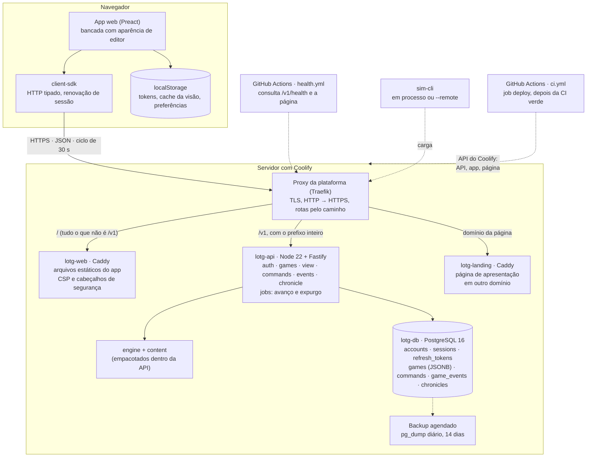
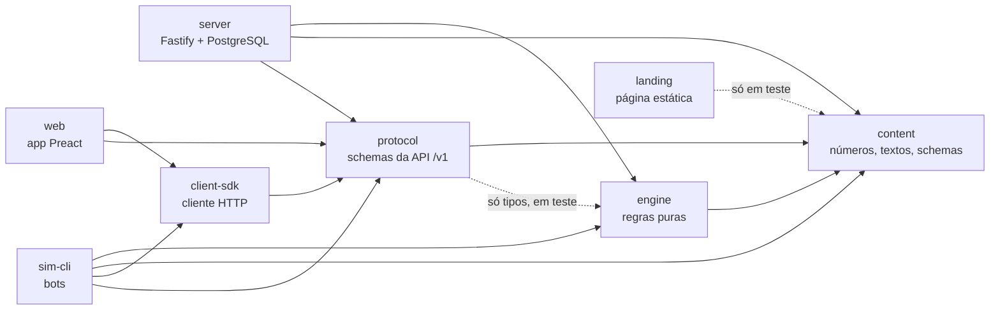

# Arquitetura da v0.1

O que foi construído no MVP de Lords of the Guild, como as peças se encaixam e onde a implementação se afasta do [Game Design Document](../GAME_DESIGN.md). O GDD §14 continua sendo o contrato; este documento descreve o estado real em 2026-10-01, data em que a v0.1 foi fechada (tag `v0.1.0`), e aponta para o código.

Para o detalhe de cada pacote: [motor](../packages/engine/README.md), [servidor](../packages/server/README.md), [app web](../packages/web/README.md), [simulador](../packages/sim-cli/README.md), [página de apresentação](../packages/landing/README.md) e [implantação](../deploy/README.md).

## 1. Visão geral

O diagrama do GDD §14.1, atualizado para a instalação que está no ar em `https://lords.palsincomehub.com`.



O que mudou em relação ao desenho original do GDD:

- O cliente é um **app web**, e não uma extensão do VS Code ([ADR 0008](decisions/0008-cliente-web-com-aparencia-de-editor.md)).
- A borda é o **proxy do Coolify**. O Caddy não termina TLS nem encaminha `/v1`: só serve os arquivos do app, dentro da imagem `web` ([ADR 0009](decisions/0009-implantacao-no-coolify.md), [`deploy/web.Caddyfile`](../deploy/web.Caddyfile)).
- App e API ficam na **mesma origem**. Não há CORS, e o app não tem endereço de servidor configurável.
- `battle-preview` não existe: é da v0.4.
- Há uma **página de apresentação** em domínio próprio ([ADR 0012](decisions/0012-pagina-de-apresentacao.md)): estática, sem acesso à API nem ao banco. O único caminho dela para o jogo é o link do botão "Jogar agora".
- A implantação é **automática**: cada push no `main` roda a CI e, com todos os jobs verdes, o job `deploy` pede ao Coolify o deploy da API, espera `/v1/health`, implanta o app e, por último, a página de apresentação ([`ci.yml`](../.github/workflows/ci.yml), [`deploy/README.md`](../deploy/README.md)). O deploy manual continua valendo.

Os princípios do GDD §14.1 valem como estão: o servidor é autoritativo e é o relógio; o motor é um só (servidor, simulador e testes); estado inicial, semente e log de comandos permitem refazer uma partida; o avanço é preguiçoso, então uma queda do servidor não perde nada.

## 2. Pacotes e direção das dependências



A seta aponta para o que é importado. As regras, impostas por `no-restricted-imports` em [`eslint.config.js`](../eslint.config.js):

- `engine`, `content` e `protocol` não importam `fastify`, `pg`, Drizzle nem módulos do Node. Arquivos de teste ficam fora da regra.
- `server` e `web` nunca importam um ao outro.
- `web` não importa o motor: só exibe o `ViewState` que recebe.
- `landing` não importa pacote nenhum do jogo. Só os testes dela leem `content`, para conferir as frases da Crônica que a página cita.
- `protocol` depende do motor apenas como dependência de desenvolvimento: um teste de igualdade de tipos faz o `pnpm typecheck` quebrar se `Command`, `ViewState` ou os códigos de recusa divergirem entre os dois.

Os pacotes são consumidos como fonte TypeScript (`exports` aponta para `src/index.ts`). Só o que é implantado tem build: o servidor (um único `dist/main.js`, com esbuild), o app (`packages/web/dist`, com Vite) e a página de apresentação (`packages/landing/dist`, com Vite).

## 3. Onde fica cada responsabilidade

**O servidor orquestra, o motor decide, o app exibe.**

| Responsabilidade | Onde fica |
|---|---|
| Regras de jogo: produção, consumo, obras, recrutamento, fome, objetivos | `packages/engine` (`advanceTo`, `applyCommand`) |
| Números e textos de jogo, frases da Crônica | `packages/content` |
| O que a interface mostra, com a explicação de cada número | `deriveViewState`, em `packages/engine/src/view.ts` |
| Forma dos comandos, das respostas e dos erros da API | `packages/protocol` (zod) |
| Faixas e regras de um comando (recusa com frase em português) | Motor; o servidor responde `422 GAME_RULE` |
| Relógio, autenticação, propriedade da partida, lock, persistência, recibos | `packages/server` |
| Conversão entre tempo real e tempo de jogo | Servidor (`gameTimeAt`, em `games/repository.ts`) e `deriveViewState` |
| Filtro de apresentação da Crônica (sem viradas de dia) | Servidor (`chronicleRows`) |
| Avanço de partidas paradas e expurgo de contas excluídas | Jobs do servidor, sob advisory lock (uma réplica por rodada) |
| Renovação de sessão, retentativas de rede, mesmo `commandId` no reenvio | `packages/client-sdk` |
| Estado da interface, ciclo de atualização, cache, avisos, diálogos | `packages/web` (`app/controller.ts`, `game/gameSession.ts`) |
| Credenciais e cache no navegador, sincronização entre abas | `packages/web/src/services` (`localStorage`, Web Locks, evento `storage`) |
| TLS, redirecionamento, rotas por caminho | Proxy do Coolify |
| Cabeçalhos de segurança do app (CSP, `nosniff`, HSTS) | Caddy da imagem `web` |
| Apresentação do jogo a quem ainda não joga | `packages/landing`, servida pelo Caddy da imagem `landing`, em outro domínio |
| Backup do banco | Agendamento do Coolify |
| Implantação a cada push no `main` | Job `deploy` de `.github/workflows/ci.yml`, pela API do Coolify |

O app não faz conta sobre o jogo. Quando a interface precisou de um número que não estava no `ViewState`, ele foi acrescentado no motor: `workers[].perWorkerPerHour`, `constructions.active.refund`, `population.housed` e `population.vacancies`.

## 4. O caminho de um comando

`POST /v1/games/:id/commands` com `{ commandId, type, payload }`. Tudo acontece em uma transação (`packages/server/src/games/commands.ts`):

```mermaid
sequenceDiagram
    participant App as App web
    participant API as API
    participant Eng as Motor
    participant DB as PostgreSQL

    App->>API: POST /commands { commandId, type, payload }
    API->>DB: autentica (conta e sessão, sem cache)
    API->>DB: lockGame (SELECT … FOR UPDATE, filtrado pela conta)
    API->>DB: busca recibo por (game_id, commandId)
    alt recibo existe, mesmo conteúdo
        API-->>App: status e corpo originais + X-Lords-Replayed
    else recibo existe, conteúdo diferente
        API-->>App: 409 COMMAND_ID_CONFLICT
    else comando novo
        API->>Eng: advanceTo(estado, agora em tempo de jogo)
        API->>Eng: applyCommand(estado avançado, comando)
        API->>DB: persistState (estado inteiro, eventos, state_version + 1) e recibo
        alt aceito
            API-->>App: 200 { view, events, stateVersion }
        else recusado pelo motor
            Note over API,DB: o avanço e o recibo são gravados; a ação não tem efeito
            API-->>App: 422 GAME_RULE, com o estado avançado em details
        end
    end
```

Pontos que sustentam o contrato ([ADR 0004](decisions/0004-comandos-e-cache-http.md)):

- O recibo guarda o hash do pedido, o status e o corpo completo da resposta, enquanto a partida existir. Um reenvio nunca reaplica a ordem, nem depois de um reinício do servidor.
- Uma recusa faz commit antes do 422: o desfecho sai da transação como valor e o erro é lançado depois. Uma falha inesperada desfaz tudo.
- No app, uma ordem nasce em `controller.prepare`, que fixa o `commandId`. "Tentar de novo" reenvia a mesma ordem com o mesmo identificador. Ordens nunca ficam em fila local: ou chegam ao servidor ou o jogador é avisado.
- As leituras (`GET /view`, `/events`, `/chronicle`) passam pelo mesmo lock e avançam o mundo, mas só escrevem no banco se o avanço produziu eventos.

## 5. Como o tempo funciona

Há três relógios, e cada um tem um dono.

**Tempo de jogo (motor).** Milissegundos inteiros desde o início da partida. O motor não conhece o relógio do sistema: recebe o instante como argumento. `advanceTo` anda trecho a trecho até o próximo evento da linha do tempo (fim de obra, chegada de aldeão, virada de dia, comida acabando) e aplica a produção contínua em cada trecho, com aritmética inteira. A invariante, testada por propriedade e sem tolerância: `advanceTo(t2)` dá o mesmo estado e os mesmos eventos que `advanceTo(t1)` seguido de `advanceTo(t2)`. Todos os números do conteúdo estão no ritmo Normal do GDD: um dia do calendário são 2 horas de tempo de jogo (`calendar.dayMs`) e o ano tem 84 dias.

**Tempo real (servidor).** O servidor é o único relógio (`ctx.clock()`, nunca `Date.now()` solto). A conversão é feita por partida:

```
tempo de jogo = (agora − criação da partida) × time_scale
```

`games.time_scale` é gravado na criação e não muda depois: é o ritmo que o jogador escolheu entre os oferecidos (3, 1 ou 0,5) ou, sem escolha, o `GAME_TIME_SCALE` do servidor (padrão 3, de 0,5 a 10) ([ADR 0011](decisions/0011-ritmo-3x-no-mvp.md); [ADR 0013](decisions/0013-regras-da-v0.2-tempo-ritmo-migracao-e-economia.md), decisões 2 e 2a). O mesmo valor fica em `state.settings.timeScale`, de onde o motor o lê. O tempo de jogo nunca anda para trás: se o relógio do servidor regredir, vale o último instante processado. O avanço é **preguiçoso**: acontece nas leituras e nos comandos. Um job avança as partidas sem estado persistido há mais de uma hora, em lotes de 100; não existe temporizador por partida em memória, e o processo pode reiniciar a qualquer momento.

**Visão em tempo real (interface).** `deriveViewState(state, gameTimeMs, { timeScale })` entrega tudo já convertido para o relógio do jogador:

| Valor | Conversão |
|---|---|
| Prazos (`secondsRemaining`, `durationSeconds`, `secondsToNextDay`, …) | Divididos pelo ritmo, em segundos reais, arredondados para cima |
| `depletesInSeconds` e `famine.secondsElapsed` | Divididos pelo ritmo, arredondados para baixo |
| Taxas por hora (`perHour`, `grossPerHour`, `perWorkerPerHour`) | Multiplicadas pelo ritmo: são por hora real |
| Textos de explicação (`breakdown`) | Escritos com os números já por hora real |
| Estoques, custos, níveis, calendário | Sem conversão |

No ritmo 3, um dia de jogo dura 40 minutos reais e o ano, 56 horas. O app não faz nenhuma conversão: do ritmo, ele só recebe o rótulo pronto (`settlement.paceLabel`) e, nas boas-vindas, as opções de `GET /catalog`. O que ele faz com o tempo:

- Ciclo de 30 s com a aba visível (2 min em segundo plano): `GET /view` com ETag e `GET /events?after=`. O ETag é o SHA-256 do corpo `{ view, stateVersion }` e muda com o tempo mesmo sem escrita no banco.
- Entre dois ciclos, as contagens regressivas andam no relógio do navegador a partir da última visão recebida.
- O Relatório de Retorno compara o cache com a primeira leitura depois de 4 horas reais sem abrir a página. Desde a v0.2 (V2D-T4), a aba que ficou aberta e **fora de vista** por 4 horas ou mais também o recebe, na volta (ver 6.2).
- O lembrete "Proteja seu reino" conta 48 horas reais desde a primeira vez da conta no navegador.

Os testes de integração e os testes em navegador rodam com `GAME_TIME_SCALE=1`, porque foram escritos nos minutos de jogo do GDD. O ritmo 3 tem testes próprios no motor e no servidor.

## 6. Divergências aceitas em relação ao GDD

O GDD e o roadmap foram atualizados para refletir as decisões abaixo; a lista serve para quem compara o que foi construído com o desenho original.

### 6.1 Decisões do autor

| Divergência | Sustentação | Estado |
|---|---|---|
| A API roda no host em desenvolvimento, e não em contêiner | [ADR 0001](decisions/0001-api-no-host-em-dev.md) | Consolidado. A imagem de produção é exercitada pelo perfil `full` e pela CI |
| O objetivo 4 recompensa +50 ouro, em vez de desbloquear Celeiro, Armazém e Torre de Vigia | [ADR 0002](decisions/0002-objetivo-4-v01.md) | Consolidado. Volta ao desbloqueio na v0.2, por mudança de conteúdo |
| `@types/node` e `@types/pg` fora da lista de bibliotecas permitidas | [ADR 0006](decisions/0006-types-node.md) | Aprovado em 2026-10-01 (adotado antes, na Fase 2). `engine`, `content` e `protocol` seguem com `types: []` |
| A Crônica (`GET /chronicle` e `/chronicle.md`) não traz as viradas de dia; `GET /events` continua trazendo | [ADR 0007](decisions/0007-cronica-sem-viradas-de-dia.md) | Aprovado em 2026-10-01 e implementado no servidor e no app |
| O cliente é um app web com aparência de editor, e não uma extensão do VS Code. Tokens em `localStorage` sob CSP estrita; a extensão foi removida | [ADR 0008](decisions/0008-cliente-web-com-aparencia-de-editor.md) | Implementado (F3W-T1 a T10). Os seis pontos foram confirmados em 2026-10-01 |
| Produção no Coolify, em três recursos, com o proxy da plataforma na borda, no lugar de um VPS com Compose e Caddy de borda | [ADR 0009](decisions/0009-implantacao-no-coolify.md) | No ar desde 2026-10-01. Backups no mesmo disco do banco (ver 6.3) |
| `GET /version` ganhou `features.githubDevice` | [ADR 0010](decisions/0010-version-informa-o-que-esta-ligado.md) | Aprovado em 2026-10-01; implementado em F3W-T8 |
| Ritmo 3× nas partidas novas, definido pelo servidor; o `ViewState` fala em tempo real. O GDD original fixava `timeScale` em 1 na v0.1 | [ADR 0011](decisions/0011-ritmo-3x-no-mvp.md) | Decidido e implementado em 2026-10-01. As partidas criadas antes da mudança seguem no ritmo 1. "Uma semana é um ano" deixa de valer no MVP |
| O vínculo GitHub fica **desligado** na v0.1. O critério de aceitação 10 fecha pelo Código do Reino | ADR 0008, ponto 2; Registro de Execução, F3W-T8 e F4-T3 | O código existe (rotas de *device flow*, app, testes) e só foi exercitado com um GitHub simulado. **Nunca foi testado com o GitHub real.** Sem `GITHUB_CLIENT_ID`, as rotas respondem 404 e o app esconde os botões |
| O lembrete "Proteja seu reino" conta 48 horas reais desde a primeira abertura no navegador, e não o 25º dia de jogo | ADR 0011, consequências | Implementado (`account/linkReminder.ts`) |
| Licença MIT | Decisão do autor em 2026-10-01 | [`LICENSE`](../LICENSE) e campo `license` dos pacotes |
| Página de apresentação em domínio próprio, em um oitavo pacote e um quarto recurso do Coolify. O GDD não previa nenhuma | [ADR 0012](decisions/0012-pagina-de-apresentacao.md) | Pedida pelo autor e implementada em 2026-10-01. Endereço, letras, título e tom são propostas a confirmar |
| A v0.1 fechou **sem o playtest de 48 horas com 3 a 5 pessoas** que o roadmap pedia (F5-T2). O playtest foi o do próprio autor | Decisão do autor em 2026-10-01; Registro de Execução, F5-T2 | O playtest com outras pessoas é a primeira tarefa da v0.2 ([roadmap-v0.2.md](roadmap-v0.2.md)). Não existem relatório de playtest nem métrica de retorno |
| Os 12 critérios de aceitação foram dados como aceitos pela decisão do autor de fechar a v0.1, depois de jogar em produção em dois navegadores, **sem avaliação critério a critério e sem evidência escrita**. O roadmap pedia a evidência registrada, em Chromium e em Firefox (F5-T1) | Decisão do autor em 2026-10-01; [acceptance-v0.1.md](acceptance-v0.1.md) | Cada aceitação se apoia nos testes automáticos e nas conferências em produção registradas; o que ninguém verificou está listado no mesmo documento |

### 6.2 O que o GDD descreve e a v0.1 não tem

Nenhum destes itens tem tarefa no roadmap do MVP. Ficaram de fora por escopo, e não por defeito.

| Item | Sustentação | Estado |
|---|---|---|
| `GET /catalog` (GDD §14.5) | Registro, F2-T2; [README do servidor](../packages/server/README.md) | Não existia na v0.1. Implementado na v0.2 (V2B-T3) só com as opções de nova partida; o `ViewState` continua trazendo o resto do que o app exibe |
| "Baixar cópia da partida (JSON)" (GDD §13.6) | Registro, F3W-T6 | Não implementado: não há rota nem comando. Existe "Baixar Crônica (Markdown)" |
| "Reiniciar partida" (GDD §13.6) | Registro, F3W-T6 | Entregue como "Nova partida", com confirmação: arquiva o feudo atual e começa outro |
| Gerador de números aleatórios com fluxos nomeados (GDD §14.3 e §18.1) | Registro, F1-T11; [README do motor](../packages/engine/README.md) | Na v0.1 não existia: o estado tinha o campo `rng`, vazio, e nenhuma regra sorteava. **Resolvido na v0.2 (V2B-T2):** `random.ts`, com os fluxos `council`, `morale` e `horde`; a moral, o Conselho e as incursões sorteiam |
| Migração de estados por `schemaVersion` (GDD §15.4) | `packages/engine/src/types.ts` (`schemaVersion: 1`) | Na v0.1 não existia código de migração: só havia a versão 1. **Resolvido na v0.2 (V2B-T1):** `migrateState` no motor e migração ao travar a partida no servidor; ver os READMEs do [motor](../packages/engine/README.md) e do [servidor](../packages/server/README.md) |
| Relatório de Retorno para quem deixou a aba aberta (GDD §13.5 fala em "ao abrir") | Registro, F3W-T10 | Na v0.1 só era montado ao **abrir a página** depois de 4 h. **Na v0.2 (V2D-T4.4 e V2E-T3.6):** a aba que ficou aberta e fora de vista por 4 h ou mais conta a ausência desde que saiu de vista e, na volta, mostra um aviso que leva ao relatório na aba Hoje (o app não troca de aba sozinho). **Limite que continua:** a aba que ficou **à vista** o tempo todo (em um segundo monitor, a noite inteira) não tem como saber que o jogador saiu: recebe os avisos e as linhas da Crônica de cada acontecimento (uma incursão, por exemplo), mas não o relatório. Detalhes no [README do app](../packages/web/README.md), "A aba que ficou aberta" |
| Escolha de dificuldade e de ritmo pelo jogador | Registro, F3-T3; `games/service.ts` | Na v0.1 a dificuldade era fixa (`lord`) e o ritmo, o do servidor. **Resolvido na v0.2 (V2B-T3):** `POST /games` aceita `difficulty` e `timeScale`, e as boas-vindas oferecem as opções de `GET /catalog` |
| Hora da Vigília com efeito | `packages/web/src/tabs/Settings.tsx` | É guardada com a partida e não muda nada no jogo; o texto das Preferências diz isso |
| Notificações com a aba fechada | Registro, F3W-T7 | Nada chega com a aba fechada. Com a aba em segundo plano, o título conta as novidades |

### 6.3 Dívidas técnicas e verificações pendentes

Conferidas no código e nos registros em 2026-10-01. Não são decisões: são coisas a resolver ou a verificar. Atravessam o fechamento da v0.1.

**Código**

| Dívida | Onde | Origem |
|---|---|---|
| Os botões de fechar aba ficam dentro do `tablist`, ao lado dos elementos `tab`; o padrão ARIA não prevê isso | `packages/web/src/workbench/EditorTabs.tsx` | Registro, F3W-T10 |
| O limite de consultas do *device flow* é por IP (30 por minuto): apertado para várias pessoas atrás do mesmo NAT. Só importa quando o vínculo for ligado | `packages/server/src/routes/auth.ts` | Registro, F3W-T10 |
| Se o relógio do servidor andar para trás, o jogo não regride, mas `commands.server_time` guarda o instante regredido; um replay só pelo log usaria esse instante | `packages/server/src/games/commands.ts` | Registro, F2-T2; README do servidor |
| A espera de `storageSettle` protege contra a leitura atrasada do `localStorage` entre processos do navegador; a corrida em si nunca foi reproduzida em teste | `packages/web/src/services/sessionLock.ts` | Registro, F3W-T3 |
| `CreateGameRequestSchema` ainda declara `timeScale: z.literal(1)`: o valor é aceito e ignorado, e qualquer outro é recusado com 400, embora o ritmo do servidor seja outro | `packages/protocol/src/api.ts` | ADR 0011 |
| Rajadas sincronizadas ficam acima da meta de desempenho (p95 de 81,6 ms em `/view` e 147,4 ms em `/commands` com 50 bots em fase); o custo de `advanceTo` depois de dias sem acesso não foi medido | [`docs/perf-v0.1.md`](perf-v0.1.md) | Registro, F2-T8 |
| O volume de `commands` cresce cerca de 3,4 kB por comando, porque o recibo guarda a resposta inteira; sem compactação nem retenção | [`docs/perf-v0.1.md`](perf-v0.1.md) | ADR 0004 |

Deixaram de ser dívida: as vagas de habitação, que o app calculava, agora vêm do `ViewState` (`population.housed` e `population.vacancies`); e o "dia 25" do lembrete, trocado pelas 48 horas reais.

**Operação**

| Pendência | Origem |
|---|---|
| Os backups ficam no mesmo disco do banco: perder o servidor perde os dois. Falta cadastrar um armazenamento externo | Registro, F4-T2; [`deploy/README.md`](../deploy/README.md) |
| Copiar `RECOVERY_CODE_SECRET` para fora do Coolify é ato do autor e não há registro de que foi feito | Registro, F4-T3 |
| Os avisos do Coolify estão marcados, mas sem canal de notificação ligado | Registro, F4-T4 |
| A reversão foi ensaiada entre dois commits com a mesma migração; nunca atravessando uma migração. Desde a v0.2 há também a migração de **estado**: o procedimento está escrito em [`deploy/README.md`](../deploy/README.md), sem ensaio com imagens | Registro, F4-T5; roadmap da v0.2, V2B-T1.6 |
| As consultas de `deploy/analytics/ops.sql` foram escritas a partir do esquema e não foram executadas em produção | Registro, F4-T4 |
| A chegada do e-mail de alerta do GitHub ao autor e o disparo do monitor pelo agendamento não foram conferidos | Registro, F4-T4 |

**Verificação**

| O que não foi verificado | Origem |
|---|---|
| Os testes automáticos rodam só em Chromium. O autor jogou em dois navegadores, sem dizer quais: Firefox não está confirmado; Safari e navegadores de celular não foram abertos | Registro, F3W-T10 e F5-T1 |
| A coluna "Manual" do [roteiro manual](manual-test-v0.1.md) não tem registro de execução passo a passo; leitores de tela não foram usados | Registro, F3W-T10 e F5-T1 |
| Em produção, ninguém verificou: o reinício de `lotg-api` com uma obra em andamento e a aba aberta, a fome e o Relatório de Retorno depois de um período longo de tempo real, e o expurgo de sete dias (as primeiras contas excluídas completam o prazo em 2026-10-08). A aceitação desses critérios se apoia nos testes automáticos | [acceptance-v0.1.md](acceptance-v0.1.md) |
| `pnpm test:e2e` nunca rodou contra a produção. Lá, as conferências foram manuais, por `curl`, pela fumaça `sim --smoke` e por uma carga de 5 bots por 2 minutos | Registro, F4-T1 e F5-T1 |
| O playtest de 48 horas com outras pessoas não foi feito | Registro, F5-T2 |
